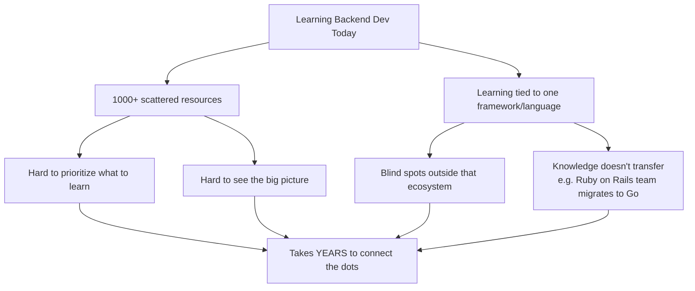
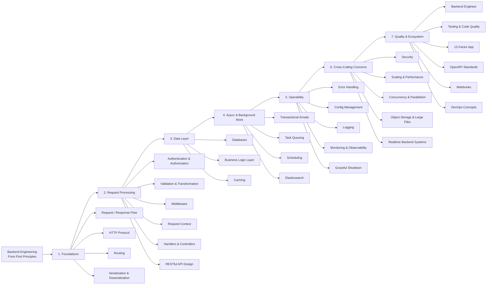
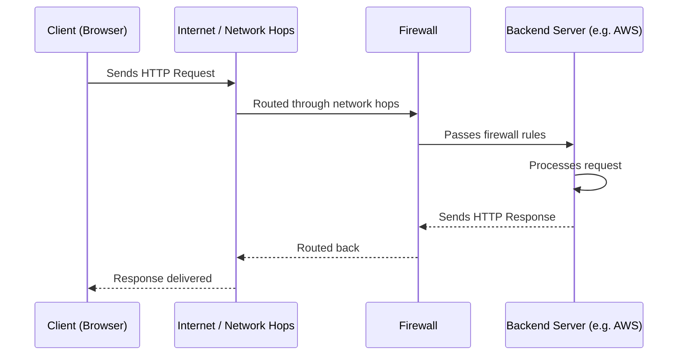
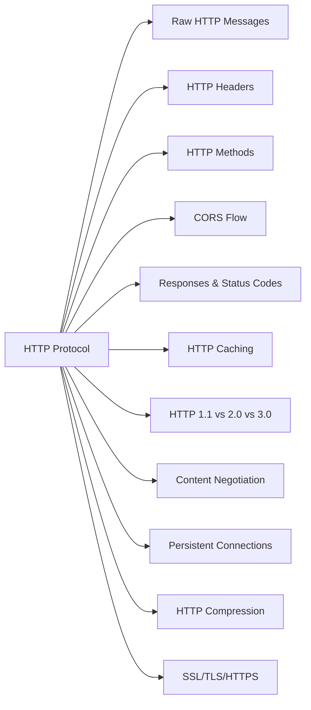
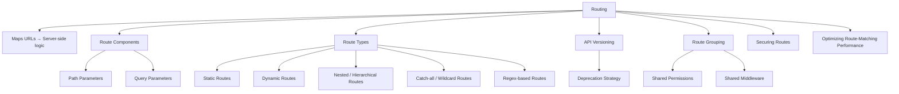
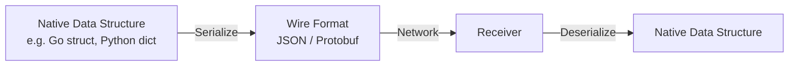

# 01. Backend For Backend Engineering - From First Principles

## 1. 📌 Overview

Backend engineering is **much more than building CRUD APIs**. True backend engineering is about building systems that are:

| Quality | Meaning |
|---|---|
| **Reliable** | The system behaves correctly and consistently, even under failure |
| **Scalable** | The system can handle growing load (users, data, traffic) |
| **Fault-tolerant** | The system keeps working (or degrades gracefully) when components fail |
| **Maintainable** | The codebase is easy to understand, extend, and fix over time |
| **Efficient** | The system uses compute, memory, and network resources wisely |

This video is the **roadmap/index** for an entire series (~30–40 videos) that teaches backend engineering from **first principles** — i.e., language- and framework-agnostic foundations — rather than starting from a specific framework like Express, Spring Boot, or Ruby on Rails.

---

## 2. ❓ The Problem This Series Solves

**Author's personal experience:** learned via trial and error, searched countless resources, read many books, and studied hundreds of open-source codebases — a time-consuming process this series aims to shortcut.

**Core idea of the series:** Teach the *underlying systems and principles* (protocols, patterns, trade-offs) so knowledge **transfers across any language or framework** — not just "how to do X in Express.js."

---

## 3. 🗺️ Full Roadmap — Mind Map

---

## 4. 🔄 High-Level Request Flow (Chapter 1 Topic)

Before diving into HTTP details, the series starts with **how a request physically travels** from a browser to a backend server and back.

**Goal of this chapter:** Build a vivid mental model of *how a client communicates with a server* and *how a server responds* — the foundation everything else builds on.

---

## 5. 🌐 HTTP Protocol

The series does a deep dive into HTTP as the backbone of client-server communication.

### 5.1 Topics Covered

### 5.2 HTTP Header Categories

| Header Type | Purpose | Example |
|---|---|---|
| **Request headers** | Info about the request/client | `Authorization`, `Accept` |
| **Representational headers** | Describe the body's format | `Content-Type`, `Content-Encoding` |
| **General headers** | Apply to both request & response | `Cache-Control`, `Connection` |
| **Security headers** | Enforce security policies | `Strict-Transport-Security`, `X-Content-Type-Options` |

### 5.3 HTTP Methods & Semantics

| Method | Typical Use | Idempotent? |
|---|---|---|
| `GET` | Retrieve a resource | ✅ Yes |
| `POST` | Create a resource / submit data | ❌ No |
| `PUT` | Replace a resource | ✅ Yes |
| `PATCH` | Partially update a resource | ❌ No (usually) |
| `DELETE` | Remove a resource | ✅ Yes |

### 5.4 Simple vs Preflight (CORS) Requests

```mermaid
sequenceDiagram
    participant B as Browser
    participant S as Server

    rect rgb(40,40,40)
    Note over B,S: Simple Request
    B->>S: GET/POST (simple headers)
    S-->>B: Response with CORS headers
    end

    rect rgb(40,40,40)
    Note over B,S: Preflighted Request
    B->>S: OPTIONS (preflight check)
    S-->>B: Allowed methods/headers
    B->>S: Actual request (e.g. PUT + custom headers)
    S-->>B: Response
    end
```

### 5.5 HTTP Caching, Compression & Protocol Versions

| Area | Techniques Mentioned |
|---|---|
| **Caching** | ETags, `max-age` header |
| **Compression** | `gzip`, `deflate`, `br` (Brotli — most commonly used) |
| **Protocol Versions** | HTTP/1.1 vs HTTP/2.0 vs HTTP/3.0 differences |
| **Security** | SSL, TLS, HTTPS |

---

## 6. 🧭 Routing

---

## 7. 🔁 Serialization & Deserialization

**Definition:** Serialization = converting native data structures into a transmittable format (e.g., before sending over network). Deserialization = converting received data back into native data structures.

### 7.1 Format Comparison

| Format Type | Examples | Pros | Cons |
|---|---|---|---|
| **Text-based** | JSON, XML | Human-readable, easy to debug | Larger size, slower to parse |
| **Binary** | Protobuf | Compact, fast | Not human-readable |

### 7.2 Top
